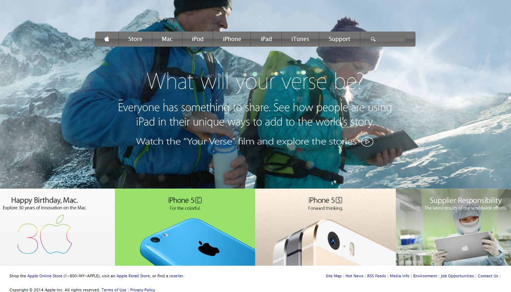

# apple-homepage


# Apple Homepage project

> This is a microverse student project for creating a homepage



> This project clones the apple.com homepage.
> The project includes a header, navigation bar, body and footer.

## Built With

- HTML
- CSS

## Live Demo

[Live Demo Link](....)

## Getting Started

 To get a local copy up and running follow these simple example steps.

### Prerequisites
> Browser
> Text editor of your choice.
> npm has to be installed in your system.
> install linters on your IDE.

### Setup
> ``` git clone https://github.com/deikdesign/apple-homepage ```

### Usage
> Open the index.html from your browser.

### Run tests
Run `npx html-validator-cli --quiet --file index.html` to run the validator over the ```index.html``` file.

## Authors

👤 **Deyan Todorov**
- Github: [@deikdesign](https://github.com/deikdesign)

👤 **Willard F. Nyamunokora**
- Github: [@bigwizzo](https://github.com/bigwizzo)

## 🤝 Contributing

Contributions, issues and feature requests are welcome!

Feel free to check the [issues page](https://github.com/BigWizzo/html-form/issues).

## Show your support

Give a ⭐️ if you like this project!

## 📝 License

This project is [MIT](lic.url) licensed.